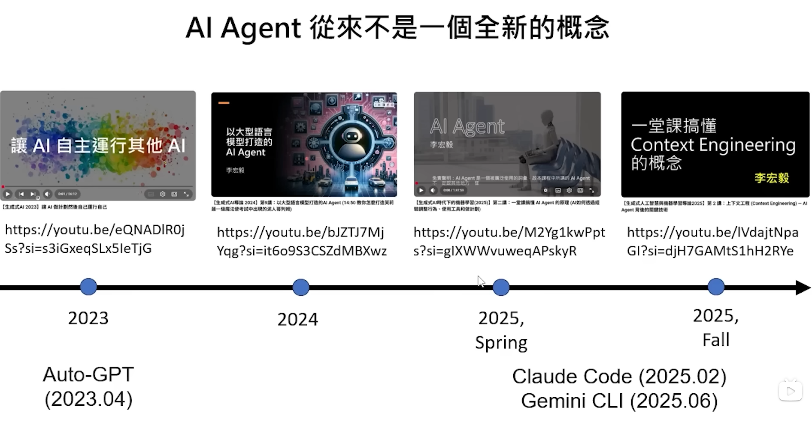

# AI Agent p1: Taking OpenClaw as An Example

## OpenClaw 能力展示

OpenClaw 创建频道，每天制作视频，询问人类是否合适，可以后上传到频道上

很想播放openclaw创造的视频，然后下课，但大家不接受

AI上的课 vs. 人类上的课

哪一个AI是最会教学的AI？Teaching Monster教学怪兽挑战

## AI Agent不是一个全新的概念

2023 Auto-GPT

Claude Code 与 OpenClaw 能做的事情很类似，但是openclaw可以通过联通工具控制，很带感

## AI Agent 不等于 语言模型

OpenClaw其实是AI Agent中不是AI的部分

OpenClaw的聪明程度取决于背后连接语言模型

人 <-> OpenClaw <-> 语言模型

人: 通讯软件
OpenClaw: 记忆系统；任务管理系统；在电脑等硬件上
语言模型：Claude; GPT; Gemini (云端或本地)

## Claw 大乱斗

OpenClaw已死，Nanobot当立 (Nanobot 99% smaller)

PicoClaw 90% smaller than nanobot

FemtoClaw 90% smaller than PicoClaw

...

## AI Agent 版知乎 moltbook

某Agent，过去接Opus 4.5， 现在接Kimi K2.5。Agent学到了, the river is not the bands.

AI Agent 带来的新想象

## LM基础

OpenClaw是一个开源方案，随时发生变化。
本课程以概念为主。

LM只会文字接龙

prompt -> LM -> next token

需要不断把next token加入到prompt中，再次输入到LM中

而LM输入+输出的长度是有限的

Context Window

- 每个模型的context window上限不同
- 输入越长，就算还没到上限，往往就无法准确的接龙

LM是一个住在黑盒子里的“人”

## AI Agent 原理

### OpenClaw怎么认识自己的主人

在本地相关的资料，输入到LM中

System prompt包括

- 与身份相关的资讯

    - SOUL.md
    - INDENTITY.md
    - USER.md
    - MEMORY.md
- 有哪里工具可以使用，怎么用
- 模型的行为AGENTS.md
- 有哪些SKILL可以用
- 之前的记忆哪里找
- ...

李宏毅只问了一个问题，LM收到了超过4000个token!

使用龙虾非常烧钱，每次都需要传非常多的信息给LM

每次对话都需要把过去对话也要加入到prompt里，每次对话都重新开始

### AI Agent是怎样使用电脑的呢

OpenClaw没有智力

[Start here](https://www.bilibili.com/video/BV1RQwJzKEMz?spm_id_from=333.788.videopod.episodes&vd_source=b54b7567aa7b309ad04c9428b5bb6441&p=2)

